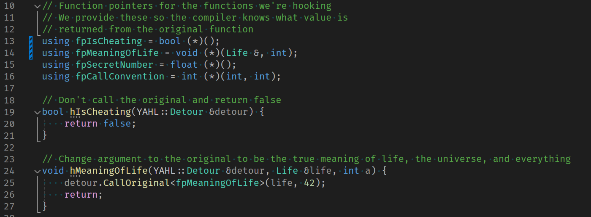

# YAHL (Yet-Another-Hooking-Library)

The world desperately needed another hooking library, so here it is. YAHL is more robust than most other hooking libraries. Supporting inline code cave hooking instead of IAT hooking.

## Features

* Only supports x86 binary hooking currently
* Not calling the original function at all
* Calling the original function with a different argument
* Different calling conventions of original functions (stdcall, cdecl, fastcall, and thiscall supported)

## Usage

A full working example is provided in the `./YAHL/src/hook_example.cpp` file which compiles to a injectable DLL. (See below for how to compile and run the example.)

The gist of how to use YAHL is the following:

1. Create a `YAHL::Detour` object and pass the address of the function you want to hook, detour function, and how many bytes to overwrite.
2. Create a function which mirrors the signature of the original function to hook, but has an additional parameter at the beginning of type `YAHL::Detour &detour`. (e.g. If your original function signature is `bool __cdecl MyFunction(int a, int b)`, then your detour function signature should be `bool __cdecl MyFunctionDetour(YAHL::Detour &detour, int a, int b)`).
3. Call `YAHL::Detour::Enable()` to hook the function.
4. If the program terminates, it's likely you have have an issue with how many bytes you are overwriting (You must have at least 5 bytes to assemble a long `jmp` but it can be more), or you have the incorrect signature/calling convention for the detour/original function.

## Setup and example tests

1. Compile the `HookMe` and `YAHL` projects.
2. Run the `Release` version of `HookMe.exe`, observe the output.
3. Run `Inject32.bat` in the `./examples` directory, this will inject the YAHL example dll into the HookMe process.
4. Observe the changed output of `HookMe.exe`.
